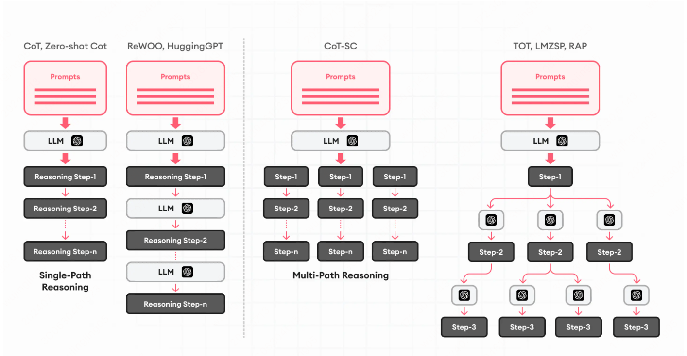

# 什么是Agent

相信大家对 `Agent` 的概念并不陌生，已然有无数软文介绍过，在此我简要介绍一下：Agent 是一个能够调用外部工具、拥有长期记忆以及根据已有信息做有效任务规划的智能体。

简要的架构图如下所示：

> 图片来源：https://www.superannotate.com/blog/llm-agents

让我们想象一个最简单的场景：北京今天的天气怎么样，并给一些旅游建议。

此时Agent会做规划：先调用查天气的工具，然后根据工具返回的结果给出一些旅游建议。

其中先调用工具然后再回复这个能力属于任务规划，模型能够调用查天气的工具属于与外部工具交互的能力，最后在得到天气结果之后再回复，这属于基于历史记忆来做内容生成的能力。

这仅仅是一个非常简单的应用场景，再来个复杂的场景：一位老师可能想基于学生成绩生成一份查漏补缺的建议报告。

老师首先需要给出所有学生的试卷得分细节，

## Memory

说的高级一点，就是智能体拥有长期记忆；说的Low 一点，就是把历史对话和开发者觉得重要的相关信息以一定格式塞入到 Prompt 当中，这样大模型就能够看到历史信息，此时便拥有了记忆。

当然，这里`说的Low一点`仅仅是为了方便大家理解，并没有任何贬低的意思。

当然，就好比如人类，记忆也分为长期记忆和短期记忆，并不是所有的内容都需要存放到记忆当中，毕竟记忆存储的空间是有限的。就好比如人类其实只能记忆一部分重要的内容，随着时间的流逝，很多曾经的美好都已忘却，甚至是曾经那个最重要人的生日。这些都不重要了，重要的是眼前这个人才是你接下来的人生路途中最重要的。

所以，记忆的内容是需要有选择性的，你可以让Agent 选择性的记忆不同的内容，根据记忆类型区分，可以将其分为两类：短期记忆、长期记忆。而这两类有点类似于思考快与慢当中的System1和System2。

### 短期记忆

> Short-Term Memory

短期记忆的作用仅限于在执行某个任务时存在的记忆，一旦任务完成之后相关的记忆即可被清除。

假如，你去医院挂号看医生，在等待的那段时间，你对医生的名字记忆非常深刻，甚至会产生一种本能反应：一旦听到这个医生的相关声音，此时就会竖起耳朵听。可是当你走出医院刷会儿手机之后，你还记得刚才那个医生的全名叫什么吗？

几乎记不得，因为这个名字对于看完病之后的我们而言，并不重要，他的作用仅仅只体现在看病那个时间段。

Agent 中的记忆也是一样的，如果要完成一个复杂的任务，通常会将其拆分成不同的小任务来执行，在不同的小任务当中的记忆内容很可能是不一样的，而当所有的任务都技术之后，只需要将任务的需求描述和执行结果给出来即可，不需要包含每个小任务中的细节。

所以，短期记忆你明白了吗？

### 长期记忆

> Long-Term Memroy

那长期记忆也非常重要，可能会一直印在脑子里面的信息，比如说：你爸妈是谁，你是谁，1+1 等于多少 等相关信息。

人的一生会很长，可能会包含很多很杂的信息，可是你的记忆容量是有限的，只能包含部分信息，所以此时你可以将记忆内容进行精简，从而达到能够记忆的目的：

1. Memory Summary：将一段时间内的记忆进行总结，归纳成一段话。
2. Important Memory：记住一段时间内的非常重要的人、事或者物。
3. RAG：将每段时间的记忆存储到数据库当中，方便后续检索，提取重点信息。

通过 Memory Summary 可以将大大减少记忆的存储长度，也不确实记忆的完整度；Important Memory 则是将重要的人、事或者物进行记录，属于高频重要信息；RAG 则可以有选择性的检索重点信息，提供给自己使用。

这些方法能够让Agent在记忆管理方面像人一样工作，处理复杂的问题，进而为人类赋能。

## Planning

任务规划是需要将一个复杂的问题拆分成多个简单的子问题，然后每个子问题也是可以继续规划进而让其对问题继续拆分，知道问题都被解决。

任务规划通常包含以下两个阶段：任务拆分和任务反思。

### 任务拆分

任务拆分就是根据当前问题尝试将其拆分多个子问题，你可以认为输入是一个问题，输出是一些todo list，然后每个todo都需要下一个Agent 去完成。

在任务拆分和任务执行的过程中，通常会使用 CoT 的相关技术来提升对于问题的的理解力，尽量将其模块化之后可以更好的生成 todo list。

当然，还有 Tree of Thought 可以对每个子问题进行递归拆分，直到问题被完全解决。

以上为常规任务拆分的方法，通常分为single-path和multi-path。

### 任务反思

Agent 创建完任务之后，在实际执行的过程中需针对于实际执行结果进行反思，如果能够发现一些问题，或者可以进一步优化任务，这样才能够更智能的完成人类的任务。

其中如何在执行过程中如何针对于实际执行结果进行反思呢？其方法主要有两种：ReAct、Reflexion。

* [ReAct](https://arxiv.org/abs/2210.03629): 在每次执行的过程中会将当前Thought、Action、Observation 输入到历史消息当中，此时由 LLM 决定接下来是否要调用某工具、是否要结束直接回复用户。
* [Reflexion](https://arxiv.org/abs/2303.11366)：

## Tool Use

1
