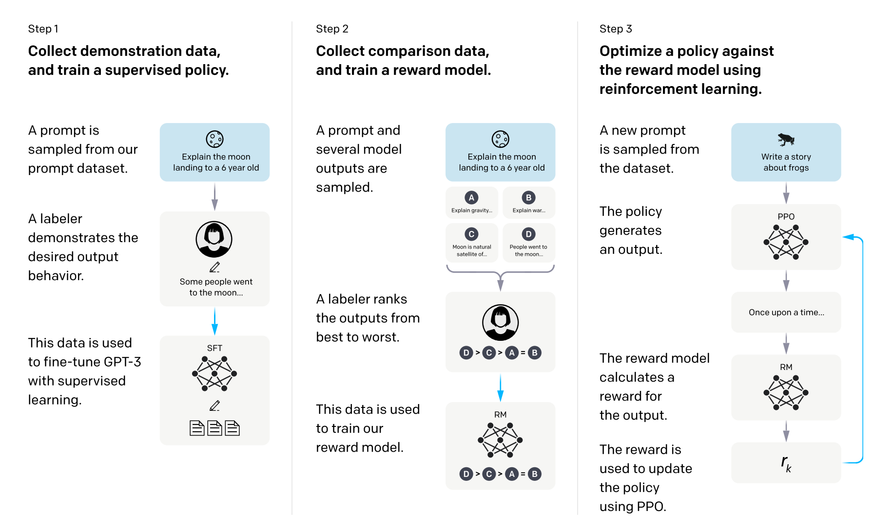

## 概览

大语言模型在预训练阶段包含的内容相当丰富且复杂，主要围绕大规模无标签文本数据的处理和模型训练展开，当然此篇内容主要围绕 `decoder-only` 类别模型围绕展开介绍。

### 概念

语言模型（Language Model）很早就出现了，可是大语言模型（**Large** Language Model）在2022年才开始爆火，通常指至少为十亿级别的模型参数。

大语言模型展示了令人出乎意料的自然语言理解能力和解决复杂任务（通过文本生成）的能力。为了快速了解这些大型语言模型是如何工作的，本部分将介绍它们的基本背景，包括规模法则、涌现能力和关键技术。

## Scaling Laws

大语言模型预训练中的Scaling Law是一个描述系统性能如何随着模型规模、训练数据量以及计算资源等因素的增加而变化的规律，Scaling Law是一种数学表达，它揭示了系统性能与其规模（如参数量、训练数据量、计算量等）之间的幂律关系

在大语言模型的预训练中，Scaling Law起到了至关重要的作用。随着模型规模的不断扩大、训练数据的不断增加以及计算资源的不断投入，模型的性能往往会得到显著提升。OpenAI、Google DeepMind等研究机构通过实验验证了这一规律，并将其应用于指导大语言模型的设计和训练。

### **核心公式与推论**

1. **KM缩放规律**：由OpenAI团队在2020年提出，揭示了模型性能L与模型参数量N、训练数据集大小D以及训练计算量C之间的幂律关系。具体公式如下：
   - $$ L(N) = (\frac{N_c}{N})^{\alpha_N} $$
   - $$ L(D) = (\frac{D_c}{D})^{\alpha_D} $$
   - $$ L(C) = (\frac{C_c}{C})^{\alpha_C} $$

   其中，$ L(\cdot) $ 表示交叉熵损失，$ N_c $、$ D_c $、$ C_c $ 是常数，$ \alpha_N $、$ \alpha_D $、$ \alpha_C $ 是幂律指数。这些公式表明，当其他因素固定时，模型性能与某个因素呈现幂律关系。

2. **Chinchilla缩放规律**：由Google DeepMind团队提出，旨在指导计算最优训练。他们通过优化损失函数 $ L(N, D) $ 在约束条件 $ C \approx 6ND $ 下的值，导出了模型大小N和数据大小D的最优分配比例。

### 结论与启示

1. **模型性能与规模的关系**：随着模型参数量、训练数据量和计算量的增加，大语言模型的性能通常会得到显著提升。但这种提升并非无限制的，当达到一定规模后，性能提升的速度会逐渐放缓。

2. **资源分配策略**：根据Scaling Law，可以合理地分配模型参数、训练数据和计算资源，以在有限的预算内获得尽可能好的模型性能。不同研究团队对于模型和数据重要性的看法可能存在差异，这需要在具体实践中进行权衡。

3. **未来发展方向**：Scaling Law不仅适用于语言模型，还可能适用于其他模态以及跨模态的任务。随着技术的不断进步和数据的不断积累，未来大语言模型的性能有望得到进一步提升。

大语言模型预训练中的Scaling Law是一个重要的经验性规律，它揭示了系统性能与规模之间的幂律关系。通过理解和应用这一规律，可以指导大语言模型的设计、训练和资源分配，推动自然语言处理领域的持续进步和发展。

### 应用场景

#### 效果可预测性

首先，对于大型模型来说，严格检查各种训练技巧或变体是不可行的，如果从小型模型中获得的经验也能应用于大型模型，那将非常有帮助。例如，可以训练小型代理模型，为大型模型找到最佳的数据混合计划[1](#doremi)

随着训练时长的增加，训练过程中可能会出现很多不稳定的因素：
1. loss 突然激增，出现不稳定的情况
2. 训练收益放缓（loss 趋于平稳）
3. 如果在数据集上面继续训练的话，很可能会出现收益递减的情况，所以要有一个监控机制。

基于 scaling law 规律，在不同size 模型上的效果表现存在一定的关联性，此时就可以用小模型的训练来监控大模型的训练过程。

#### 数据混合

当所有的数据都准备好了，也满足scaling laws 的公式，此时如何进一步优化模型训练的效果，此时就只有基于有限数据做一些 ***调整***，进而让其在发挥出最大的数据效果，此时通常使用 **数据混合** 方法。

**数据混合**方法中最关键的为不同领域数据配比，而此比例永远是一个谜，不同数据之间可能会存在 ***正相关、负相关以及不相关*** [2](#data-mixing-laws) 等关系，如何验证大语言模型在此比例下的训练有正效益，此时便可使用小模型对其进行模拟，进而得出最优混合配比策略。

:::warning 提醒

当然这个也不一定是正确的，因为目前谁也不知道 ground truth 的方法是什么，只有通过小型代理模型来做先验训练进而得出一些经验，此时再来指导大模型进行训练。

:::

### Domain能力预测

检验 LLM 训练是否收敛通常使用loss、ppl 等来衡量，可是loss 的下降和对应领域能力的提升吗？比如说数学和代码的能力。

GPT-4 技术报告 [3](#gpt4-report) 中提到不同领域的能力是可以通过 Scaling Laws 预测出来的，比如说 coding。不过这仅仅是实现的一个现象，并不代表这就是真理。

在训练过程中，甚至还会出现效果衰减的情况，如何 early stop 策略也是一个黑盒。

当然还有一些能力是无法用scaling law 来预测的，比如： in-context-learning 能力，这个一定程度上是因为模型的 size 到了一定的程度之后就会涌现。

## LLM 能力的涌现

大模型能力的涌现只在大模型中发生 [4](#emergent-abilities-of-llm) ，当模型的规模到达一定的阈值之后，模型会涌现出一些能力，这些能力是 LLM 无法预测的，此外还和一些复杂任务相关联，比如说数学、代码等需要逻辑推理相关的能力。

而我们评估大模型的能力通常会评估它的通用能力。

### 上下文学习

上下文学习（In-Context Learning）能力是 LLM 的一项重要能力，它允许模型在给定的上下文中进行推理和预测，根据用户给的上下文内容给出一个符合预期的回复，这些内容通常是大模型没有学习过的。

在GPT系列模型中，175B GPT-3 模型通常展现出较强的ICL能力，但GPT-1和GPT-2模型则不然。同时此能力还与特定的下游任务有关，例如 13B GPT-3模型在算术任务（如三位数的加减法）上能够展现出ICL能力，但175B GPT-3模型甚至在 Persian QA 任务上表现不佳。

### 指令跟随

指令跟随（Instruction Following）是指模型能够理解和执行给定指令的能力。

真实场景中的指令多种多样，大模型是不可能将所有的指令都学习到，在现代社会中，无论是工作场所、家庭生活还是日常社交，指令跟随能力都是一项至关重要的技能，也一定程度上体现出模型的智能性和定制性。

指令数据可以来源于 QA任务、分类任务、信息抽取任务、结构化生成等任务，当指令类型和数据集变多，模型到达一定的size（与scaling law 有关，可是不是一个绝对的数值）后即可表现出优秀的zero-shot 的能力。

### 任务推理

复杂的任务通常是需要有较强的推理能力，比如要解决一个数学问题、写一段逻辑复杂的代码、通过组装不同的工具来解决一个复杂的问题等。这个推理的过程通常会使用思维链（Chain-of-Thought）的方式进行推理，进而提升大模型对复杂任务的解决能力。

这种推理能力也是大模型涌现出来的能力之一，人们推断这是来源于代码数据训练而来 [5](#chain-of-thought-prompting) ，同时此项能力当模型规模越大，相对比不用CoT的Prompt策略而言，性能也会得到显著提升。

当然这个只是一个常规看法，不同模型在不同任务上的表现也不太一样，不一定能 100% 应用于所有场景。

## 提升LLM的效果

随着大模型的应用面越来越广，对其能力的要求也是越来越高，分别有：代码生成能力、指令跟随、格式化输出、推理能力、工具调用以及长上下文能力。

GPT-3为了提升以上能力，分别从以下方面做了优化：

### 大量代码训练数据

OpenAI于2021年7月推出了Codex [6](#evaluation-large-language-model) ，这是一个在GitHub代码的大型语料库上进行微调的GPT模型。研究表明，Codex可以解决非常困难的编程问题，并且在解决数学问题方面也有显著的性能提升 [7](#neural-network-math-problem)。

代码数据除了提升复杂代码生成的能力，也会提升对于复杂问题的推理能力，特别是提升基于思维链的推理能力 [8](#llm-text-generation)。

### 人类偏好对齐

OpenAI对人类对齐的相关研究可以追溯到2017年（或更早）：[Learning from human preferences](https://openai.com/index/learning-from-human-preferences/)，文章中介绍了一种基于强化学习方法让模型从人类的标注反馈中学习到相关知识。

这篇博客发布不久就继续发布了 PPO [9](#neural-network-math-problem) 方法，它现在已成为从人类偏好中学习的基础强化学习算法。

在2022年又发布了InstructGPT [10](#instruct-gpt) 用于改进GPT-3模型的人类对齐方法，它正式建立了一个三阶段的人类反馈强化学习（Reinforcement Learning from Human Feedback，RLHF）算法

## 参考文章

* [1] [Doremi: Optimizing data mixtures speeds up language model pretraining](https://arxiv.org/abs/2305.10429) 

* [2] [数据混合定律：通过预测语言模型表现优化数据配比](https://open-moss.com/cn/data-mixing-laws/) 

* [3] [OpenAI, “Gpt-4 technical report,”](https://arxiv.org/abs/2303.08774) 

* [4] [Emergent abilities of large language models](https://arxiv.org/abs/2206.07682) 

* [5] [Chain-of-Thought Prompting Elicits Reasoning in Large Language Models](https://arxiv.org/abs/2201.11903) 

* [6] [Evaluating Large Language Models Trained on Code](https://arxiv.org/abs/2107.03374) 

* [7] [A Neural Network Solves, Explains, and Generates University Math Problems by Program Synthesis and Few-Shot Learning at Human Level](https://arxiv.org/abs/2112.15594) 

* [8] [Pretrained Language Models for Text Generation: A Survey](https://arxiv.org/abs/2105.10311) 

* [9] [Deep reinforcement learning from human preferences](https://arxiv.org/abs/1706.03741) 

* [10] [Training language models to follow instructions with human feedback](https://arxiv.org/pdf/2203.02155) 
